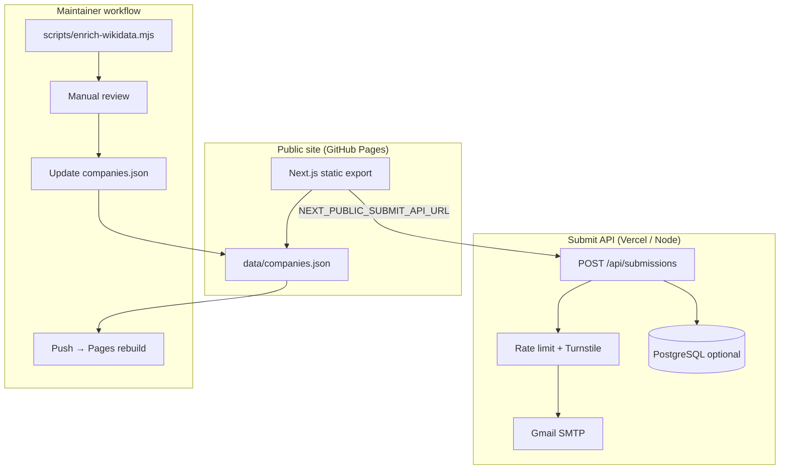
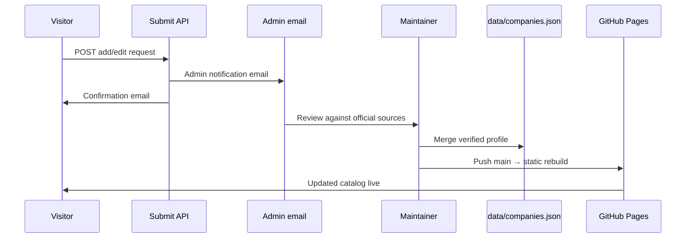
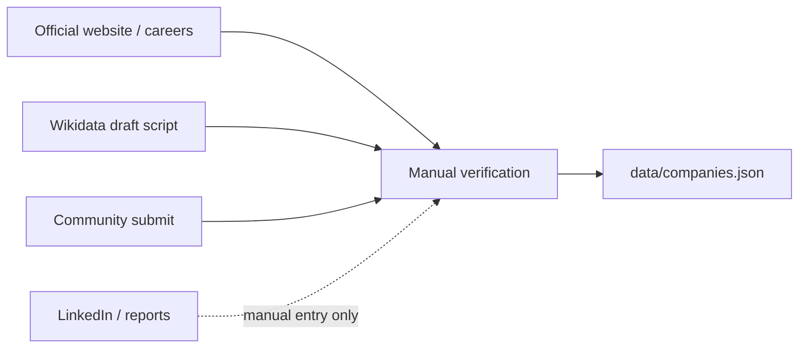

# Typewise

> Know your company type before you apply — verified, source-linked company profiles for job seekers and researchers.

[](https://github.com/nuthanm/typewise/actions/workflows/deploy-pages.yml)
[](https://github.com/nuthanm/typewise/actions/workflows/ci.yml)
[](https://nextjs.org/)
[](https://www.typescriptlang.org/)
[](LICENSE)

**Community-maintained directory. Not affiliated with listed companies. No dummy data — only verified entries.**

---

## Data integrity

- Catalog lives in [`data/companies.json`](data/companies.json) — every company has **`sources`**, **`lastVerified`**, and **`dataYear`**
- Category counts are **computed from real entries**, not placeholder numbers
- Home page shows an **accuracy notice** after the hero: data is for the current catalog year, may change, and users should **Submit request** to report issues
- Interview patterns and headcount use notes when approximate; unverified fields are omitted

---

## Architecture & workflows

### System overview



### Catalog update workflow



### Data sourcing workflow (no scraping of restricted sites)



| Step | Command / action |
|------|------------------|
| Draft from Wikidata | `npm run enrich:wikidata -- "Company Name" slug` |
| Review draft | Check `data/drafts/slug.draft.json` against official site |
| Publish | Merge into `data/companies.json`, set `category`, `sources`, `lastVerified` |
| Deploy catalog | Push to `main` → GitHub Actions runs `build:pages` |

---

## What this app does

| Capability | Description |
|------------|-------------|
| **Browse** | Filter product / service / hybrid — verified-only in search |
| **Verified stamp** | Manual check on official pages before publish — see `/brief` slide 9 |
| **Catalog progress** | Landing shows verified / in progress / awaiting review |
| **Profiles** | Source-linked fields, data year, Verified badge |
| **The Brief** | [`/brief`](/brief) — stakeholder deck |
| **Submit** | Report errors or request adds + optional update emails |
| **Feedback** | [`/feedback`](/feedback) — did we help your career research? |
| **Policies** | Privacy, Terms, cookie consent, AdSense gating |

---

## Quick start

```bash
npm install
cp .env.example .env.local
npm run dev
```

- Browse: [http://localhost:3000](http://localhost:3000)
- The Brief: [http://localhost:3000/brief](http://localhost:3000/brief)

---

## Deploy (GitHub Pages + submit API)

**Catalog (static)** — GitHub Pages via [`deploy-pages.yml`](.github/workflows/deploy-pages.yml):

```bash
npm run build:pages
# output in out/ — uploaded by Actions
```

Set repository variable **`SUBMIT_API_URL`** (e.g. your Vercel app URL) so the static form posts to a live API.

**Submit API (server)** — deploy the full Next app (with `app/api/submissions`) to **Vercel** with env vars from [`.env.example`](.env.example):

| Variable | Purpose |
|----------|---------|
| `SMTP_*`, `MAIL_TO` | Gmail App Password + admin inbox |
| `TURNSTILE_*` | Bot protection |
| `DATABASE_URL` | Optional — store submissions in PostgreSQL |
| `NEXT_PUBLIC_SUBMIT_API_URL` | Set on Pages build only (GitHub variable) |

Run DB migration: [`db/submissions.sql`](db/submissions.sql)

---

## Email templates

[`lib/email-templates.ts`](lib/email-templates.ts) — admin + user emails include:

- Data year and “verify before publishing” (admin)
- Thank-you for helping keep the catalog accurate (user)
- Footer with disclaimer + link to **Submit request**

---

## Routes

| Path | Description |
|------|-------------|
| `/` | Directory + accuracy notice |
| `/brief` | The Brief presentation |
| `/companies/[slug]` | Verified profile + sources |
| `/submit` | Add / edit request (+ update alert opt-in) |
| `/feedback` | Career research feedback |
| `/privacy-policy`, `/terms-and-conditions` | Legal |
| `/api/submissions` | POST handler (server deploy only) |

---

## Standards

Aligned with [aidevreference](https://github.com/nuthanm/aidevreference): Turnstile, honeypot, rate limits, sanitization, cookie consent, AdSense `ads.txt`, CSP in production (disabled in dev for Turbopack).

---

## License

See [LICENSE](LICENSE) if present.
